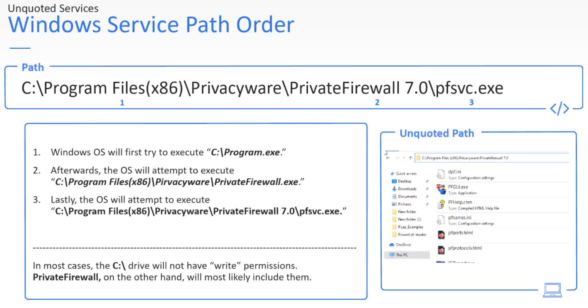
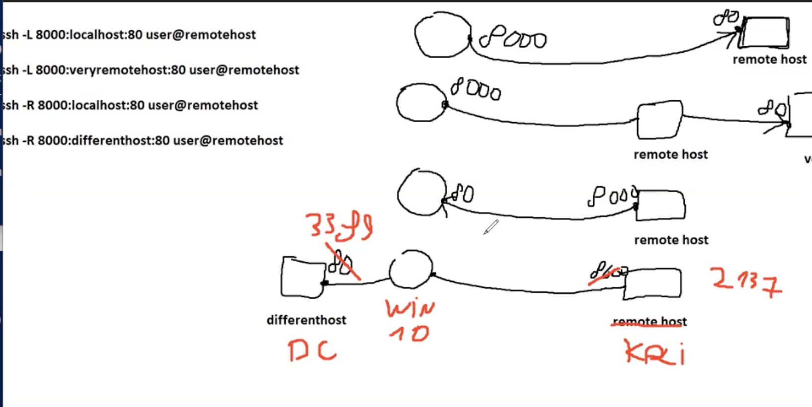

---
layout:
  title:
    visible: false
  description:
    visible: false
  tableOfContents:
    visible: false
  outline:
    visible: false
  pagination:
    visible: false
---

# burp suite

<figure><figcaption></figcaption></figure>

<figure><figcaption></figcaption></figure>

wchodzimy na [http://burp](http://burp) i ściągamy CA Certificate

<figure><figcaption></figcaption></figure>

<figure><figcaption></figcaption></figure>

<figure><figcaption></figcaption></figure>

<figure><figcaption></figcaption></figure>

i importujemy

<figure><figcaption></figcaption></figure>

<figure><figcaption></figcaption></figure>

<figure><figcaption></figcaption></figure>

**TRAFFIC INTERCEPTION & MANIPULATION**

<figure><figcaption></figcaption></figure>

<figure><figcaption></figcaption></figure>

**REPEATER**

jeśli chcemy zmieniać coś w locie

<figure><figcaption></figcaption></figure>

<figure><figcaption></figcaption></figure>

klikamy send i otrzymujemy od razu odpowiedź w sekcji Response

**INTRUDER**

Do robienia brute-force na stronie

<figure><figcaption></figcaption></figure>

Klikamy Clear §

<figure><figcaption></figcaption></figure>

i zaznaczamy konkretny parametr, który chcemy fuzzować/brute-forcować i klikamy Add §

<figure><figcaption></figcaption></figure>

przechodzimy do Payloads

<figure><figcaption></figcaption></figure>

i wybieramy payload type

a w payload options robimy swoją listę do payload, czyli jakie wartości mają być zaczytane w miejsce zaznaczone §§

<figure><figcaption></figcaption></figure>

i klikamy Start Attack

<figure><figcaption></figcaption></figure>

_TYPY ATAKÓW_

SNIPER

Po jednym payloadzie na raz

BATTERING RAM

<figure><figcaption></figcaption></figure>

<figure><figcaption></figcaption></figure>

strzelamy jednocześnie w kilka miejsc

jednocześnie w USER i PHPSESSID

<figure><figcaption></figcaption></figure>

PITCHFORK

korzysta z kilku setów payload

<figure><figcaption></figcaption></figure>

mamy do wyboru 2 zestawy payload

<figure><figcaption></figcaption></figure>

Payload 1 będzie umieszcany gdzie jest 1 pozycja - tam gdzie §bee§

payload 2 tam gdzie 2 pozycja - §bug1212§

<figure><figcaption></figcaption></figure>

<figure><figcaption></figcaption></figure>

ogólna lista payloadów będzie równa najkrótszej liście z tych payload

1 attak - 1 wartość z payload set 1 i 1 wartość z payload set 2 - czyli w parach

<figure><figcaption></figcaption></figure>

<figure><figcaption></figcaption></figure>

CLUSTER BOMB

tak jak pitchfork, tylku tu robi wszystki kombinacje payload set 1 z każdym wpisem z payload set 2 itd

<figure><figcaption></figcaption></figure>

<figure><figcaption></figcaption></figure>

<figure><figcaption></figcaption></figure>

<figure><figcaption></figcaption></figure>

**SEQUENCER**

próbuje znaleźć sposób generowania niby losowych np. sesji numerów odpowiedzi jaki jest algorytm/klucz generowania tych liczb przez serwer

<figure><figcaption></figcaption></figure>

**DECODER**

<figure><figcaption></figcaption></figure>

**COMPARER**

wysyłamy dwa request i porównujemy

<figure><figcaption></figcaption></figure>

<figure><figcaption></figcaption></figure>

