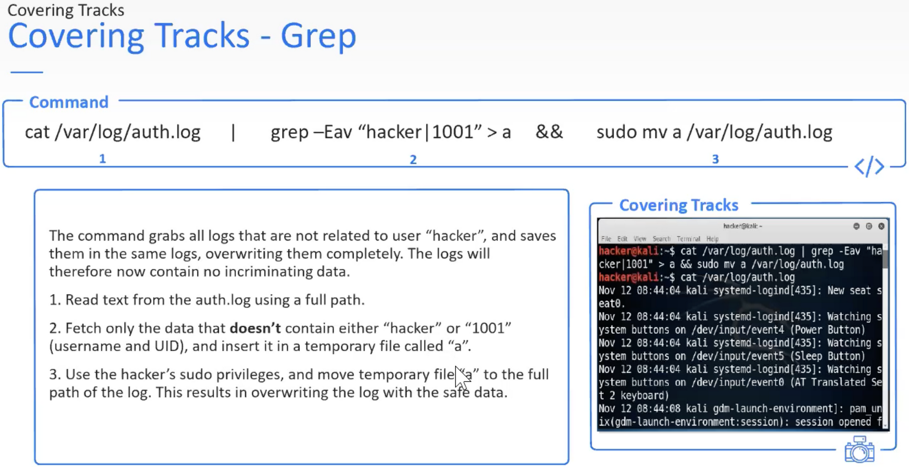

---
layout:
  title:
    visible: false
  description:
    visible: false
  tableOfContents:
    visible: false
  outline:
    visible: false
  pagination:
    visible: false
---

# covering tracks

<figure><figcaption></figcaption></figure>

