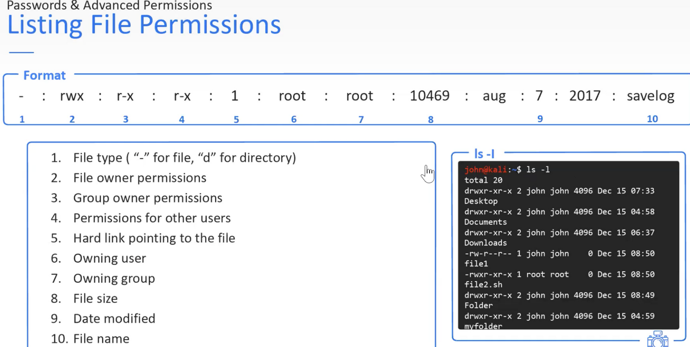
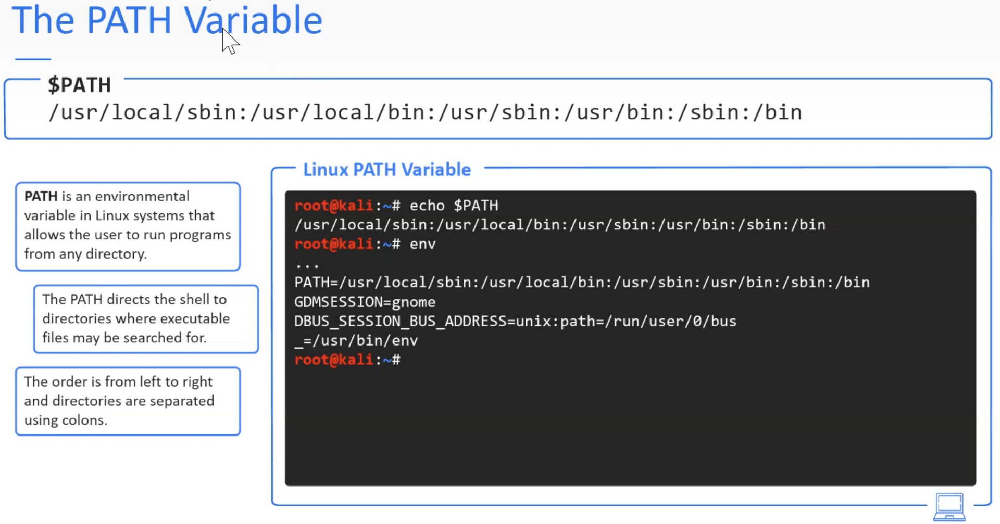

---
layout:
  title:
    visible: false
  description:
    visible: false
  tableOfContents:
    visible: false
  outline:
    visible: false
  pagination:
    visible: false
---

# file permission

<div data-full-width="true">

<figure><figcaption></figcaption></figure>

</div>

szukanie plików, do których użytkwonicy mają uprawnienia zapisywać

```
find / -type f -writable 2 > /dev/null
```

<div data-full-width="true">

<figure><figcaption></figcaption></figure>

</div>
