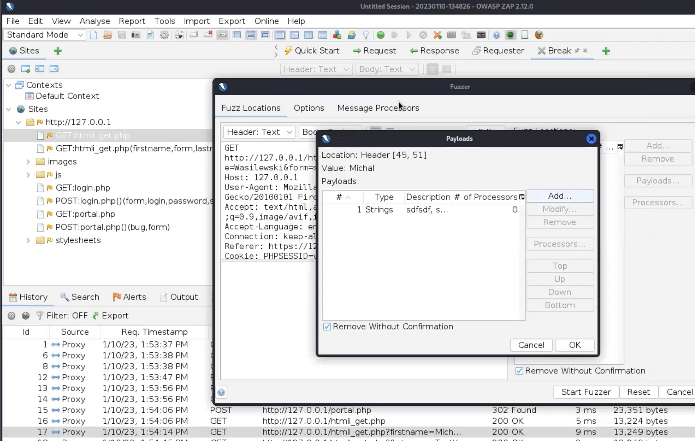

---
layout:
  title:
    visible: false
  description:
    visible: false
  tableOfContents:
    visible: false
  outline:
    visible: false
  pagination:
    visible: false
---

# loop

<div data-full-width="true">

<figure><figcaption></figcaption></figure>

</div>

<div data-full-width="true">

<figure><figcaption></figcaption></figure>

</div>

<div data-full-width="true">

<figure><figcaption></figcaption></figure>

</div>


```python
cars = ["BMW","Toyota","Audi","FSO"]
car_klient=input("podaj markę auta: ")

for car in cars:
  if car_klient==car:
    print("Mamy to auto")
  else:
    continue
print("Bye, bye")

#to samo z if
if car_klient in cars:
  print("mamy to auto")
else:
  print("bye, bye")
  
#printowanie wszytskich samochodów w liście
for i in range(len(cars)):
  print(cars[i])
  
#wyświetla tylko car 0 i 1
for i in cars[0:2]:
  print(i)
```



```python
#kasowanie duplikatów w tabeli
st_tab ["a","b"]
st1=[]
for word in st_tab:
  if word not in st1:
    st1.append(word)
    
#lub w prostszy sposób set nie przyjmuje duplikatów i kastujemy na listę
new_list=list(set(st_tab))
```


<div data-full-width="true">

<figure><figcaption></figcaption></figure>

</div>

<div data-full-width="true">

<figure><figcaption></figcaption></figure>

</div>


```python
final ={}
while true:
  c=input("Kontynuowac podawanie produktow: tak/nie")
  if c=="tak":
    key=input("Produkt: ")
    val=float(input("cena: "))
    final.update({key:val})
  elif c=="nie":
    break
  else:
    print("niewlasciwe dzialanie")
print(final)

ceny=list(final.values())
print(list(ceny))
cena_koncowa=0

for i in ceny:
  cena_koncowa +=1
print(cena_koncowa)
```


<div data-full-width="true">

<figure><figcaption></figcaption></figure>

</div>


```python
i = 0
while i < 5:
  print("I'm IN")
  i+=1
print("I'm OUT")
```



```python
while true:
  i=input(">> ")
  if i=="exit":
    break
  print("I'm IN")
print("I'm OUT")
```


<div data-full-width="true">

<figure><figcaption></figcaption></figure>

</div>
