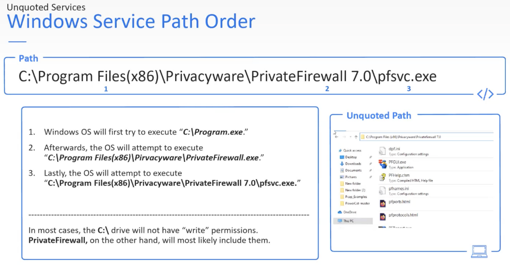

---
layout:
  title:
    visible: false
  description:
    visible: false
  tableOfContents:
    visible: false
  outline:
    visible: false
  pagination:
    visible: false
---

# unquoted services

<div data-full-width="true">

<figure><figcaption></figcaption></figure>

</div>


```python
#szukanie unquoted services
wmic service get name,displayname,pathname,startmode |findstr /i "auto" |findstr /i /v "c:\windows\\" |findstr /i /v """

#jak mamy taki folder (ze spacją), w którym jest program który włacza się sam automatycznie przy startupie systemu np C:\Amiti Antivirus to możemy stworzyć plik Amiti.exe i on się uruchomi
```


<div data-full-width="true">

<figure><figcaption></figcaption></figure>

</div>
