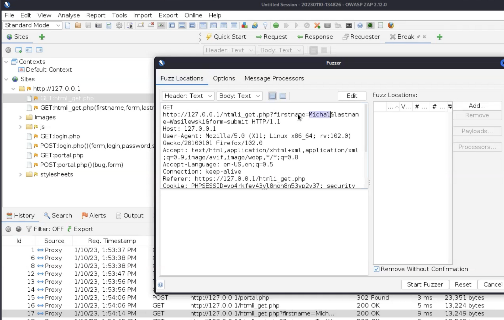
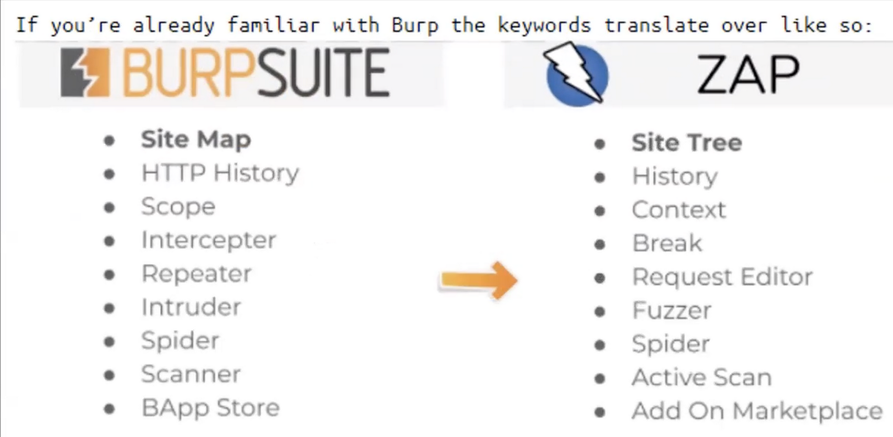

---
layout:
  title:
    visible: false
  description:
    visible: false
  tableOfContents:
    visible: false
  outline:
    visible: false
  pagination:
    visible: false
---

# zap + AUTOMATED SCAN

```
sudo apt install zaproxy
```

tak jak w burp ustawiamy FoxyProxy w Firefox

ma **ACTIVE SCANNER**

<div data-full-width="true">

<figure><figcaption></figcaption></figure>

</div>

<div data-full-width="true">

<figure><figcaption></figcaption></figure>

</div>

<div data-full-width="true">

<figure><figcaption></figcaption></figure>

</div>

<div data-full-width="true">

<figure><figcaption></figcaption></figure>

</div>

<div data-full-width="true">

<figure><figcaption></figcaption></figure>

</div>

<div data-full-width="true">

<figure><figcaption></figcaption></figure>

</div>

<div data-full-width="true">

<figure><figcaption></figcaption></figure>

</div>

**AUTOMATED SCAN**

patrzymy na jakim porcie ZAP nasłuchuje

<div data-full-width="true">

<figure><figcaption></figcaption></figure>

</div>

Taki port trzeba ustawić w FoxyProxy

<div data-full-width="true">

<figure><figcaption></figcaption></figure>

</div>

wchodzimy poprzez Firefoxa na stronę

[http://hack-yourself-first.com](http://hack-yourself-first.com)

Klikamy automated Scan w ZAP

<div data-full-width="true">

<figure><figcaption></figcaption></figure>

</div>

Po skanowaniu klikamy generate report

<div data-full-width="true">

<figure><figcaption></figcaption></figure>

</div>
